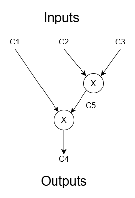

# Pinocchio Proof-of-Concept (Simplificado)

Este repositório contém uma implementação **didática** e **simplificada** do protocolo
**[Pinocchio](https://www.andrew.cmu.edu/user/bparno/papers/pinocchio.pdf)** (SNARK baseado em QAPs), escrita em **SageMath**.  
O objetivo é fornecer um código funcional e legível que permita entender os
componentes principais do sistema:

- Representação de circuitos como **QAPs**
- Geração de chaves
- Provação
- Verificação
- Estrutura algebraica necessária para um SNARK do tipo Pinocchio

A implementação **não** é segura para uso em produção.  
Serve exclusivamente para fins educativos e experimentação.

---

## Estrutura dos Arquivos

### **`pinocchio_simple.sage`**
Arquivo principal do sistema.  
Contém:

- Implementação simplificada do protocolo Pinocchio
  - `KeyGen`
  - `Prove`
  - `Verify`
- Um simulador de grupos bilineares (placeholders) usado para evitar dependência de bibliotecas mais avançadas.
- Utilização do arquivo `SimpleQAP.sage' para obter um QAP de um circuito simples.
- Execução completa do fluxo de prova → verificação para o circuito em questão.

Este arquivo é o **ponto de entrada** do projeto.

---

### **`SimpleQAP.sage`**
Define a estrutura de um **QAP simplificado**, incluindo:

- Armazenamento dos polinômios  
  `v_i(x), w_i(x), y_i(x), t(x)`
- Avaliação dos polinômios em pontos escolhidos
- Montagem da prova para o QAP
- Funções auxiliares relacionadas à algebra polinomial

É uma pequena biblioteca auxiliar usada por `pinocchio_simple.sage`.

---

## Como Executar

### **Pré-requisitos**
- Python 3
- **SageMath** instalado (versão ≥ 9 recomendado)

### **Executando**

1. Abra um terminal na pasta do projeto.
2. Rode o arquivo principal com o interpretador do Sage:

```bash
sage pinocchio_simple.sage
```

## 🔢 Entradas e Saídas do Circuito

No fluxo de execução do sistema, o circuito de teste é definido por um **vetor de entradas** `u_in` e uma **saída esperada** `u_out`.  

- **`u_in`**: lista de elementos do campo `F` correspondentes às entradas do circuito.  
  Exemplo no código:

```python
u_in = [F(3), F(5), F(7)]
```

- **`u_out`**: elemento do campo `F` que representa a saída alegada do circuito após aplicar a função definida pelo mesmo.  
  No nosso circuito de teste, a saída é simplesmente o produto das entradas:

```python
u_out = F(105)  # 3 * 5 * 7 = 105
```

- **`u`**: combinação das entradas com a saída, usada para gerar a prova do SNARK:

```python
u = u_in + [u_out]
```

### 💡 Observações

1. `u_in` pode ser alterado para testar diferentes entradas do circuito.
2. `u_out` deve ser consistente com a função do circuito; caso contrário, a prova não será válida.
3. O vetor `u` é passado para as funções `evaluate_circuit` e `prover_make_proof`, e a verificação é feita em `verifier_check`.

### 🖼 Circuito

Segue o diagrama do circuito de teste (arquivo `arithmetic_circuit.png`):



> A imagem acima ilustra as portas do circuito e como as entradas `u_in` são processadas para produzir `u_out`.
